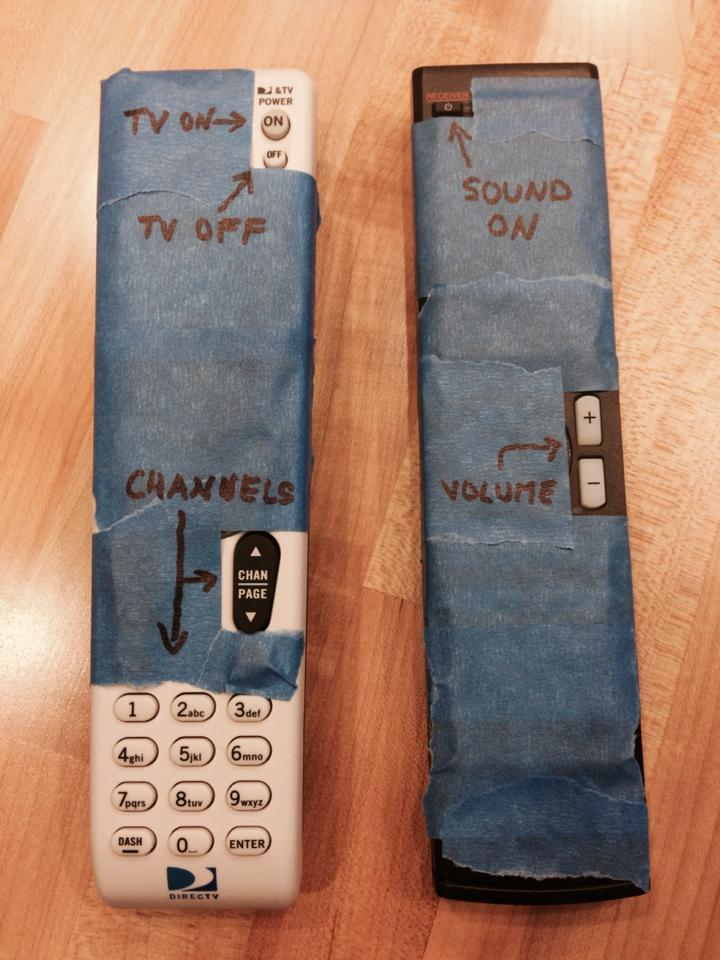

{width="33%"}

This class is hosted on GitHub, and we will use the `git` program and GitHub accounts
to distribute lecture notes and code.
We talked about RStudio, git and GitHub in class, but to review:

* [RStudio](https://www.rstudio.com/) is an interface to R, with support for git and GitHub integration
* `git` is a program for version control (mostly useful for plain text documents) 
* GitHub and BitBucket are websites/companies which host `git` repositories 

GitHub and BitBucket both offer free public or private repositories.
GitHub seems to be more popular for open source projects.

You can start a `git` repository (repo) by either *cloning* an existing repo
(as you will do for this course), or *initializing* a repo
from scratch. 

We want to clone the course repo in RStudio, but first, we may need to 
install or upgrade the software on your computer. We need to do the following
steps:

* Install/upgrade R to version 4.6
* Install RStudio for Desktop
* Install git
* Hook RStudio up to use git and GitHub

We will use R version 4.6 which is paired with Bioconductor 3.23. 
If you don't have Bioconductor installed that is fine, we will do 
this in a later class.

```{r}
R.version.string
BiocManager::version()
```

The first step can be done by visiting [CRAN](https://cran.r-project.org), and
clicking the appropriate link for your operating system. When you load R,
you want it to say that R is version 4.6 when you type `sessionInfo()`.

The second step can be done by visiting the [RStudio](https://www.rstudio.com/) website.

The third and fourth step are best accomplished by following the instructions
at the [happygitwithr](http://happygitwithr.com/) website. You should
follow the instructions at the link above to: register a
GitHub account, install git, introduce yourself to git, set up keys
for SSH, connect RStudio to Git and GitHub.

This class has two "views"  you might say. 
The [HTML/website version](https://biodatascience.github.io/compbio/) and the 
[GitHub version](https://github.com/biodatascience/compbio_src) which
has all the "source" Rmarkdown files. From the GitHub version,
you can poke around, and click on Rmarkdown files, even see the history of the code.
If you want to look at the raw text for a quarto file (`.qmd`), 
you can click the **Raw** link on the top of the document.

To clone the class repo, you should go to the GitHub version of this class 
and look for a green link that says "Clone or download". 
You should copy the link that appears to the clipboard.

Now, open RStudio, and follow the menu items: 
*File > New Project > Version Control > Git*. 
You will paste the link from the previous step into the box that 
says "repository URL". You can set the project directory name to `compbio`.

Following this, you should see a number of directories, which contain
quarto files (`.qmd`) in the Files panel on the lower right hand side. And there
will be a git tab in the top right panel. The git tab will allow you
to **pull** down new material as the course goes on and homeworks are
posted to the course repo.

